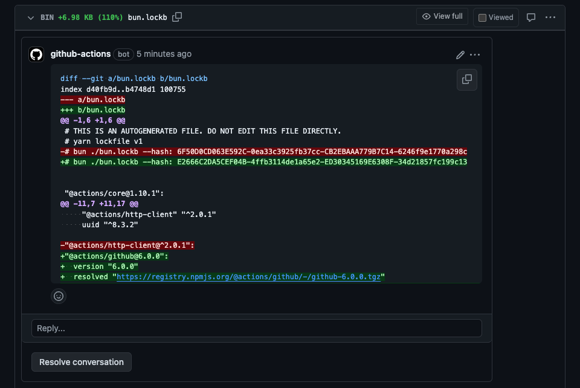

# Bun Diff Action

[](https://github.com/koki-develop/bun-diff-action/releases/latest)
[](https://github.com/koki-develop/bun-diff-action/actions/workflows/ci.yml)
[](https://github.com/koki-develop/bun-diff-action/actions/workflows/build.yml)

Show diff of `bun.lockb` on Pull Request.



## Usage

```yaml
on:
  pull_request:

jobs:
  bun-diff:
    runs-on: ubuntu-latest
    steps:
      - uses: actions/checkout@v4
      - uses: koki-develop/bun-diff-action@v1
```

> [!NOTE]
> If the `Settings` > `Actions` > `General` > `Workflow permissions` setting is not set to `Read and write permissions`, you need to explicitly set the `permissions:` setting.
> ```yaml
> permissions:
>   contents: read
>   pull-requests: write # Required to add a comment to a pull request
> ```


## LICENSE

[MIT](./LICENSE)
